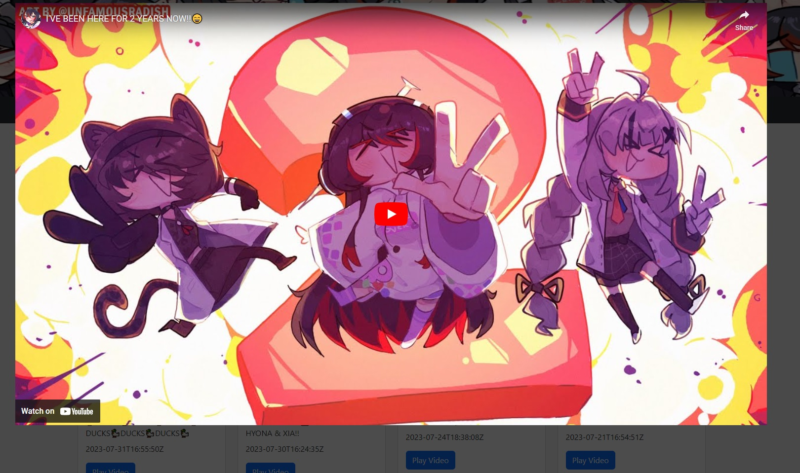

# vTuberFanPageProject

The vTuberFanPageProject is a curated fan page dedicated to vTuber talents. It aims to provide a carefully selected and limited list of vTubers, along with details sourced from fans. Additionally, the platform showcases the vTubers' works directly from their authentic YouTube channels.

# Screenshots

*Screenshot of the Profile Page, showcasing vTuber talent profiles and details.*

*Screenshot of the Video Page, displaying a collection of vTubers' videos.*

*Screenshot of the Video Player Overlay, providing controls for video playback.*

# Technologies Used

- FrontEnd: [React App](https://create-react-app.dev/) and [Bootstarp CSS](https://getbootstrap.com/)
- Services used: [Google Cloud](https://cloud.google.com/)
- API Used: [Youtube Data API v3](https://developers.google.com/youtube/v3) and [Mediawiki API](https://www.mediawiki.org/wiki/API:Properties)
- API Testing: [Postman](https://www.postman.com/)
