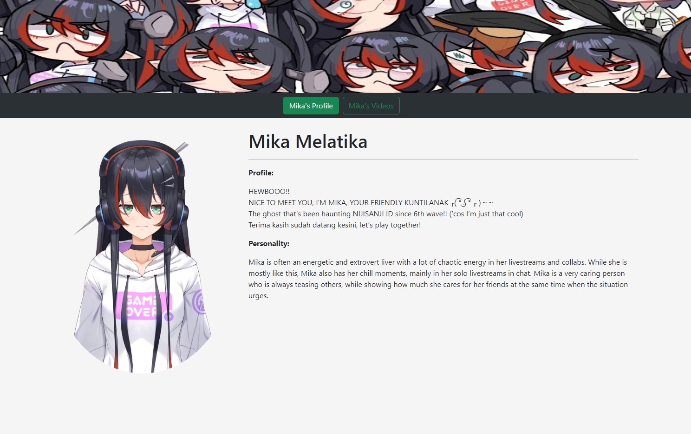

# vTuberFanPageProject

The vTuberFanPageProject is a curated fan page dedicated to vTuber talents. It aims to provide a carefully selected and limited list of vTubers, along with details sourced from fans. Additionally, the platform showcases the vTubers' works directly from their authentic YouTube channels.

## Screenshots

*Screenshot of the Profile Page, showcasing vTuber talent profiles and details.*

*Screenshot of the Video Page, displaying a collection of vTubers' videos.*

*Screenshot of the Video Player Overlay, providing controls for video playback.*

## Technologies Used

- FrontEnd: [React App](https://create-react-app.dev/) and [Bootstarp CSS](https://getbootstrap.com/)
- Services used: [Google Cloud](https://cloud.google.com/)
- API Used: [Youtube Data API v3](https://developers.google.com/youtube/v3) and [Mediawiki API](https://www.mediawiki.org/wiki/API:Properties)
- API Testing: [Postman](https://www.postman.com/)
- Web Hosting: [Netlify](https://www.netlify.com/?attr=homepage-modal)

## Demo Site

[vTuber Fan Page Project](https://stately-speculoos-00b976.netlify.app/MikaVideoPage)

## Future Enhancements

- Move API data collection to backend to prevent hitting API quota.
- Collect and display more statistics like subscriber count, video view and like count.
- Modularize the FrontEnd to make it easier to scale and add more vTuber talents.

## References

  - [Anson the Developer](https://www.youtube.com/@ansonthedev/videos): Using Google Cloud environment and Youtube Data API v3 key management.
    - [Google OAuth 2.0 with Node.js, Express, and Passport #1](https://youtu.be/Q49gGXCCY_4)
    - [Search for YouTube Channels with YouTube Data API](https://www.youtube.com/watch?v=f7uy_KxOa7k)
  - [Mika Melatika Youtube Channel](https://www.youtube.com/@MikaMelatika): Make sure to subscribe :)
  - [Comment Picker](https://commentpicker.com/youtube-channel-id.php): For getting youtube ID
  - [Virtual YouTuber Wiki](https://virtualyoutuber.fandom.com/wiki/Virtual_YouTuber_Wiki): References of vTuber's backstories
